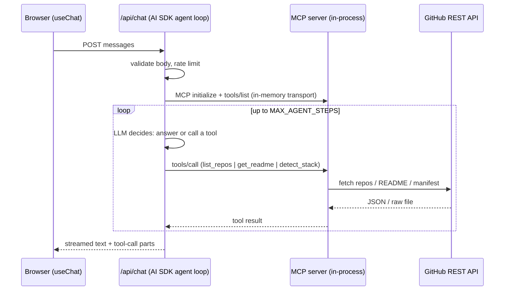

# Portfolio Agent

A small, complete example of a **GenAI-powered fullstack app**: a chat UI, an **LLM agent** with a tool loop, and a **Model Context Protocol (MCP) server** that exposes a GitHub portfolio as tools. The agent answers questions like *"which projects use Supabase?"* by calling those tools on live GitHub data.

Everything runs on free tiers (Google AI Studio or Groq, public GitHub API, Vercel) and the LLM provider is an environment variable, not a code change.

## Architecture



Three layers, each swappable on its own:

| Layer | Where | Role |
|---|---|---|
| **MCP server** | `packages/mcp-server` | Framework-agnostic package. Hexagonal: tools depend on a `GitHubPort`; the REST adapter is one implementation. Runs in-process, over HTTP (`/api/mcp`) or over stdio (any MCP host). |
| **Agent** | `apps/web/src/app/api/chat` | Vercel AI SDK `streamText` with `stopWhen: isStepCount(...)`. Tools come from `createMCPClient(...).tools()`: a real MCP client, connected to the real server over an in-memory transport by default. |
| **UI** | `apps/web/src/components/chat` | `useChat` container plus presentational parts. Every tool call is rendered with its status and payloads. |

**Why in-process by default?** The agent and the MCP server ship together, so the agent does not need a network hop, a self-request on serverless, or any URL derived from the incoming request. Set `MCP_SERVER_URL` to point the agent at any remote MCP server instead; the wiring stays the same because it is MCP on both sides.

The provider registry (`apps/web/src/lib/llm/provider.ts`) is one table: `PROVIDER_REGISTRY` maps a name to its default model, API key variable and `@ai-sdk/*` factory. Adding a provider is adding one entry (plus installing its package).

## Quick start

Requirements: Node >= 22.12 and pnpm.

```bash
pnpm install
cp apps/web/.env.example apps/web/.env.local
# add GOOGLE_GENERATIVE_AI_API_KEY (free at https://aistudio.google.com/apikey)
pnpm dev
```

Open http://localhost:3000 and ask about the projects.

### Switching providers

```bash
# apps/web/.env.local
LLM_PROVIDER=groq        # google (default) | groq
GROQ_API_KEY=...
# optional model override, e.g. LLM_MODEL=qwen/qwen3.6-27b
```

Defaults live in `PROVIDER_REGISTRY` (`gemini-3.7-flash` for Google, `openai/gpt-oss-120b` for Groq).

### Pointing it at another GitHub user

Set `GITHUB_OWNER` in `apps/web/.env.local`. The owner is server configuration: tools never accept it as input, so a caller cannot redirect the server (and any `GITHUB_TOKEN` it holds) to another account.

## Use the MCP server from Claude Code (or any MCP host)

Over HTTP, while `pnpm dev` is running:

```bash
claude mcp add --transport http portfolio-agent http://localhost:3000/api/mcp
# with MCP_AUTH_TOKEN set on the server:
claude mcp add --transport http portfolio-agent http://localhost:3000/api/mcp \
  --header "Authorization: Bearer <token>"
```

Over stdio, without the web app:

```bash
pnpm mcp:build
claude mcp add portfolio-agent -- node packages/mcp-server/dist/stdio.js
```

Then ask Claude Code: *"Use portfolio-agent to list the repos and detect the stack of the newest one."*

## Security notes (demo-grade, but deliberate)

- `/api/mcp` is open outside production unless `MCP_AUTH_TOKEN` is set. **In production, an unset `MCP_AUTH_TOKEN` fails closed**: every request is refused with a 503 rather than silently staying open. Set the token before deploying with any credential worth protecting.
- Both public endpoints (`/api/mcp` and `/api/chat`) share one guard floor (`lib/http/guards.ts`): rate limit first, then auth. `/api/mcp` and `/api/chat` each get their own rate-limiter instance, so one endpoint's traffic never evicts the other's buckets.
- `/api/chat` validates the body with zod (message count, parts, text length, roles) and applies an in-memory per-IP rate limit (20 requests / 10 minutes). The limiter is per process, so on serverless it is best-effort; use a shared store for real traffic.
- The rate-limiter's bucket map is bounded (10,000 tracked keys by default): expired buckets are pruned first, and if still over the cap the oldest remaining bucket is evicted, so a flood of distinct client keys cannot grow the map without limit.
- Client identity for rate limiting trusts `x-forwarded-for`/`x-real-ip` only when `TRUST_PROXY_HEADERS=1` is set. Vercel rewrites those headers at its edge for direct traffic, which is why they are trustworthy there, but the same is not true off-platform. Leave it unset outside Vercel (or behind an untrusted proxy): every caller then shares one rate-limit bucket, which is safe (over-throttling) rather than trivially bypassable per request.
- Error responses are opaque in production (`{ error, code }`); details go to the server log. Outside production the `detail` field is included to help development.
- Repository names and file paths are validated before any GitHub request is built.
- **Never set `MCP_AUTH_TOKEN` to the same value as `GITHUB_TOKEN`.** They protect different boundaries: `MCP_AUTH_TOKEN` gates who may call `/api/mcp`, `GITHUB_TOKEN` is the credential the server presents to GitHub. The MCP route never forwards an inbound bearer to the GitHub adapter, but the two secrets should still never collide.
- `/api/chat` also caps the aggregate size of the validated `messages` payload (`MAX_PAYLOAD_BYTES`, 128 KiB), on top of the per-message, per-part and per-text-part caps. A per-part ceiling would only bound one part while the message and part caps still permit hundreds of them; the aggregate budget bounds the whole request regardless of how the size is spread across parts.
- **Client-authored history is trusted, by design.** The client sends the whole conversation back on every turn, including assistant turns and tool-call results it fabricated itself, and the server replays that history into the model context unverified (`convertToModelMessages` in `src/app/api/chat/route.ts`). There is no server-side session state or signed history. This is safe only because every MCP tool reachable from that context is read-only and pinned to the server-configured `GITHUB_OWNER` (`resolveOwner`): a fabricated tool result can mislead the model, but it cannot widen access or redirect a call to another owner's data. If a tool ever becomes write-capable or accepts a caller-supplied target instead of a server-pinned one, this trust boundary must be revisited.

## Tests

```bash
pnpm test        # vitest in both packages
pnpm typecheck   # tsc in both packages
pnpm lint
```

The MCP server is tested through a real MCP client over an in-memory transport (`packages/mcp-server/test/server.test.ts`), the tools against a fake `GitHubPort`, and the REST adapter against an injected `fetch`. The web package tests the in-process MCP connection through `@ai-sdk/mcp`, request validation, rate limiting, auth and the provider registry. No network access is needed to run the suite.

## Project structure

```
apps/web/                      Next.js app (App Router)
  src/app/api/chat/route.ts    agent loop (AI SDK + in-process MCP client)
  src/app/api/mcp/route.ts     MCP server over Streamable HTTP (optional bearer auth)
  src/lib/llm/provider.ts      LLM provider registry
  src/lib/mcp/client.ts        MCP connection: in-process by default, remote via MCP_SERVER_URL
  src/lib/mcp/auth.ts          bearer auth for /api/mcp, fails closed in production
  src/lib/chat/request.ts      zod validation of the chat body
  src/lib/chat/rate-limit.ts   fixed-window rate limiter
  src/lib/http/env.ts          injected Env type, isProduction, trustsProxyHeaders
  src/lib/http/guards.ts       shared guard floor: rate limit, then auth, for both public routes
  src/lib/http/errors.ts       opaque client errors
  src/lib/agent/instructions.ts  system prompt + step budget
  src/components/chat/         chat UI (container + presentational)
packages/mcp-server/
  src/ports/github.ts          GitHubPort (hexagonal port)
  src/adapters/github-rest.ts  GitHub REST adapter
  src/tools/                   list_repos, get_readme, detect_stack
  src/server.ts                McpServer factory + tool registration
  src/validation.ts            GitHub owner / repository name rules
  src/owner.ts                 resolveOwner(): the one place the owner comes from
  src/stdio.ts                 stdio entrypoint
```

## Free-tier notes

- **Gemini** free tier (Flash models) allows roughly 10 requests/minute and a few hundred per day. One question costs 2-4 LLM calls, so the agent caps its loop at `MAX_AGENT_STEPS`. Do not enable billing on the Google Cloud project or the free tier disappears.
- **Groq** is a drop-in fallback (`LLM_PROVIDER=groq`) with a separate quota.
- **GitHub** allows 60 unauthenticated requests/hour per IP. A token with no scopes (`GITHUB_TOKEN`) raises it to 5,000/hour.

## Stack

Next.js 16, React 19, Tailwind CSS 4, Vercel AI SDK 7 (`ai`, `@ai-sdk/react`, `@ai-sdk/mcp`, `@ai-sdk/google`, `@ai-sdk/groq`), MCP TypeScript SDK 2 (`@modelcontextprotocol/server`), Zod 4, Vitest 5, pnpm workspaces.
